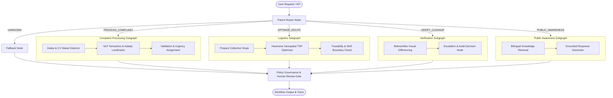

# SwachhLoop AI — Phase 4 AI Services & LangGraph Multi-Agent Documentation

> Phase 4: AI Services & Hierarchical LangGraph Multi-Agent Integration  
> Focus Area: Kalady Grama Panchayat, Kerala

---

## 1. Overview

Phase 4 elevates SwachhLoop AI from a civic complaint tracker into an autonomous, closed-loop multi-agent system. It integrates:
- **Modular AI Services** for waste detection, complaint NLP analysis, route optimization, cleanup verification, and civic knowledge retrieval (RAG).
- **Hierarchical Multi-Agent Architecture** built with **LangGraph**, coordinating specialized subgraphs with typed state, policy governance, and human review gates.
- **FastAPI Endpoints** (`/api/ai/*`) secured with Phase 3 role-based access control (RBAC).
- **Local-First & Pluggable Design**: Runs out-of-the-box in deterministic mock/local mode without API keys, with pluggable support for Gemini and OpenAI.

---

## 2. Architecture & Multi-Agent Graph Design



---

## 3. Core AI Services

All services inherit from abstract base classes defined in `backend/services/` and are resolved via factory functions:

### A. Waste Detector Service (`backend/services/waste_detector.py`)
- **Interface**: `WasteDetectorService` (`detect(image_bytes)`, `classify(image_bytes)`)
- **Implementations**:
  - `RuleBasedWasteDetector`: Deterministic local provider using Pillow image channel variance, image aspect ratios, and heuristic category scoring.
  - `VisionWasteDetector`: Pluggable cloud vision model (Gemini / OpenAI) with automatic fallback.
- **Factory**: `get_waste_detector()`

### B. Complaint Analyzer Service (`backend/services/complaint_analyzer.py`)
- **Interface**: `ComplaintAnalyzerService` (`analyze(text)`, `extract_location(text)`)
- **Domain Specialization**: Tailored for **Kalady, Kerala** landmarks (e.g., *Kalady Junction, MC Road, Mattoor, Piraroor, Temple Road, Sree Sankaracharya University, Malayattoor Road, Kanjoor, Panchayat Office*).
- **Urgency Levels**: `CRITICAL` (hospital waste, fire, toxic chemicals), `HIGH` (carcasses, clogged drains, severe stench), `MEDIUM` (garbage piles, plastics), `LOW` (dry leaves, dust).
- **Implementations**:
  - `DeterministicComplaintAnalyzer`: Regex and NLP keyword matching with ambiguity detection.
  - `LLMComplaintAnalyzer`: Pluggable LLM provider with fallback.
- **Factory**: `get_complaint_analyzer()`

### C. Route Optimizer Service (`backend/services/route_optimizer.py`)
- **Interface**: `RouteOptimizerService` (`optimize(locations, start_location)`, `estimate_travel_time(origin, destination)`)
- **Algorithm**: Haversine great-circle distance matrix + greedy nearest-neighbor TSP heuristic with stop service time overhead (5 min per stop) and Kalady ward collection velocity (25 km/h).
- **Factory**: `get_route_optimizer()`

### D. Cleanup Verifier Service (`backend/services/cleanup_verifier.py`)
- **Interface**: `CleanupVerifierService` (`verify(before, after)`, `compute_change_score(before, after)`)
- **Algorithm**: Normalized grayscale difference (`PIL.ImageChops.difference`) and pixel variance metrics.
- **Verdicts**: `VERIFIED_CLEAN` (change $\ge 0.60$), `PARTIALLY_CLEAN` ($0.30 \le \text{change} < 0.60$), `FAILED` (change $< 0.30$ or identical images), `UNVERIFIED` (missing input).
- **Factory**: `get_cleanup_verifier()`

### E. Civic Knowledge / RAG Service (`backend/services/knowledge_service.py`)
- **Interface**: `KnowledgeRetrieverService` (`retrieve(query, top_k)`, `answer_query(query, language)`)
- **Knowledge Base**: `data/knowledge_base.json` with official civic guidance on waste segregation, Haritha Karma Sena schedules & user fees, Kalady RRF/MCF facility at Mattoor, and plastic bans/penalties.
- **Bilingual**: Seamlessly handles English and Malayalam queries (Unicode `U+0D00-U+0D7F`).
- **Factory**: `get_knowledge_service()`

---

## 4. LangGraph Multi-Agent Subgraphs

1. **Complaint Processing Subgraph** (`backend/agents/complaint_subgraph.py`):
   - Nodes: `intake` $\to$ `analysis` $\to$ `validate`
   - Flags critical hazard complaints (`urgency == "critical"`) for mandatory supervisor sign-off.
2. **Logistics Subgraph** (`backend/agents/logistics_subgraph.py`):
   - Nodes: `prepare_tasks` $\to$ `optimize_route` $\to$ `evaluate_feasibility`
   - Validates stops and checks if route exceeds single-shift limits (>40 km or >6 hours).
3. **Verification Subgraph** (`backend/agents/verification_subgraph.py`):
   - Nodes: `verify_evidence` $\to$ `escalation_decision`
   - Strict governance: Does not auto-verify uncertain cleanups; triggers `ESCALATE_MANUAL_REVIEW` when confidence $< 0.80$.
4. **Awareness Subgraph** (`backend/agents/awareness_subgraph.py`):
   - Nodes: `retrieve_knowledge` $\to$ `generate_response`
   - Returns grounded answers with source citations.
5. **Parent Orchestrator** (`backend/agents/orchestrator.py`):
   - Coordinates subgraphs via `SwachhLoopState` typed dictionary.
   - Preserves audit trails with timestamped execution steps.

---

## 5. API Endpoints (`/api/ai/*`)

| Method | Path | Auth / Role | Description |
|--------|------|-------------|-------------|
| `POST` | `/api/ai/detect-waste` | Authenticated | Detect waste in uploaded photo (multipart/form-data) |
| `POST` | `/api/ai/analyze-complaint` | Authenticated | NLP analysis of complaint text and location |
| `POST` | `/api/ai/optimize-route` | Cleaner / Staff / Admin | Compute optimal visiting sequence for stops |
| `POST` | `/api/ai/verify-cleanup` | Cleaner / Staff / Admin | Before/after image change detection |
| `POST` | `/api/ai/awareness` | Authenticated | Bilingual civic waste guidance (EN / ML) |
| `POST` | `/api/ai/workflow/run` | Staff / Admin | Execute multi-agent LangGraph workflow |

---

## 6. Configuration & Running in Mock vs. Real Model Mode

### Local Mock Mode (Default)
No API keys required. All features run locally:
```bash
# In .env:
AI_PROVIDER=mock
AI_MODEL_NAME=mock-model
RAG_KNOWLEDGE_PATH=data/knowledge_base.json
CLEANUP_VERIFICATION_THRESHOLD=0.60
```

### Configuring a Real Cloud Provider (Gemini / OpenAI)
To enable real cloud multi-modal models:
```bash
# For Gemini:
AI_PROVIDER=gemini
AI_MODEL_NAME=gemini-1.5-flash
GEMINI_API_KEY=your_gemini_api_key_here

# For OpenAI:
AI_PROVIDER=openai
AI_MODEL_NAME=gpt-4o-mini
OPENAI_API_KEY=your_openai_api_key_here
```
If an API key is missing or an external API call fails, the system automatically falls back to local deterministic providers without crashing.

---

## 7. Running Tests

```bash
# Run all 93 backend and AI tests:
pytest -v

# Run only Phase 4 AI tests:
pytest tests/test_ai_services.py tests/test_ai_agents_and_api.py -v
```

---

## 8. Current Limitations & Scope Boundaries

- **Local Mock Heuristics**: The local waste detector uses image channel metrics; real YOLO weights can be plugged in when deployed to GPU servers.
- **RAG Knowledge Base**: Currently loaded from structured civic JSON; can be migrated to ChromaDB/pgvector when vector indexing is desired.
- **Deterministic TSP**: Uses greedy nearest-neighbor with 2-opt; sufficient for urban wards ($< 100$ stops). OR-Tools can be activated for large multi-vehicle routing problems.
- **No WhatsApp/Telegram**: Preserved as out-of-scope for Phase 4.
